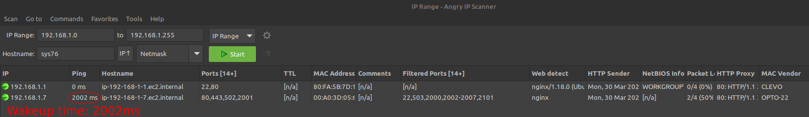
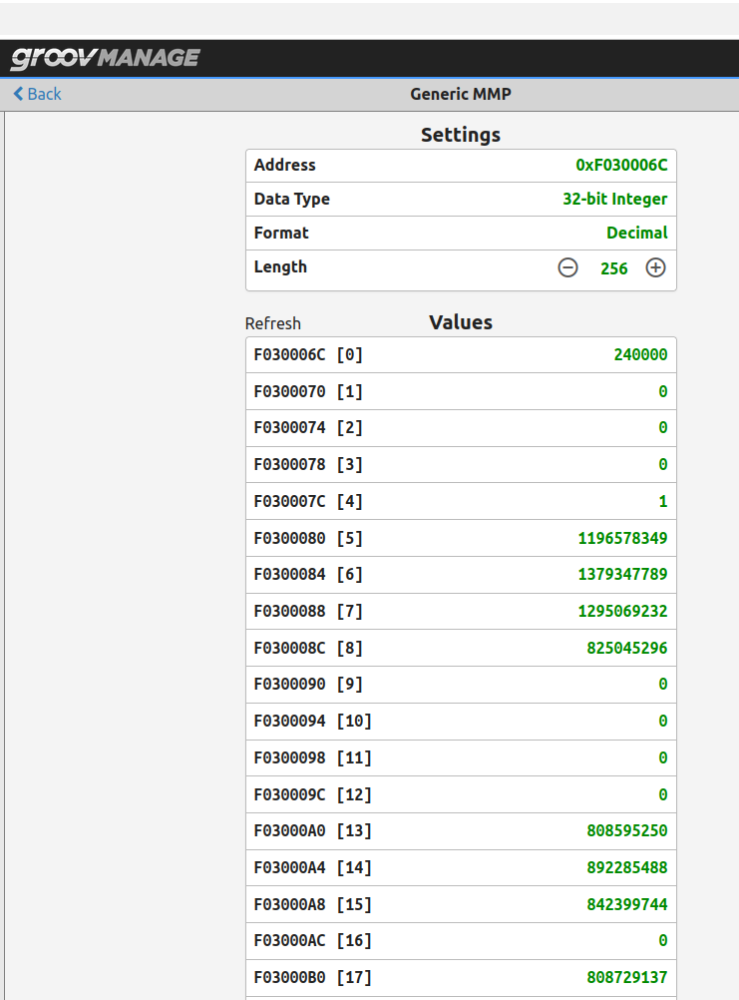

<pre>
# RioMMP
An OptoMMP strip of hardware mappings specificly to Groov Rio devices. 

############# TL;DR ####################################
Eric looks into how the Optos really work, using MMP!
Conclusion: multiple settings could create problems.

#############Discussion: ##################
should the PLC for any reason due to packet collisions, congestion, noise, or...
have netwrk communication drop out, the way the PLCs respond could prevent the 
system from recovering.   
  

############### Testing ################################ 
Here, the dhcp server will close when the network port closes. 
$ time sudo dhclient enp12s0f1
real	5m7.649s
user	0m0.035s
sys	0m0.035s
  
This proves network timeouts.  
  
Here, Wakeup time is 2002ms
  

  
Heres is what youll see if you try to edit settings on the Groov Rio.  
   

  
  
</pre>
